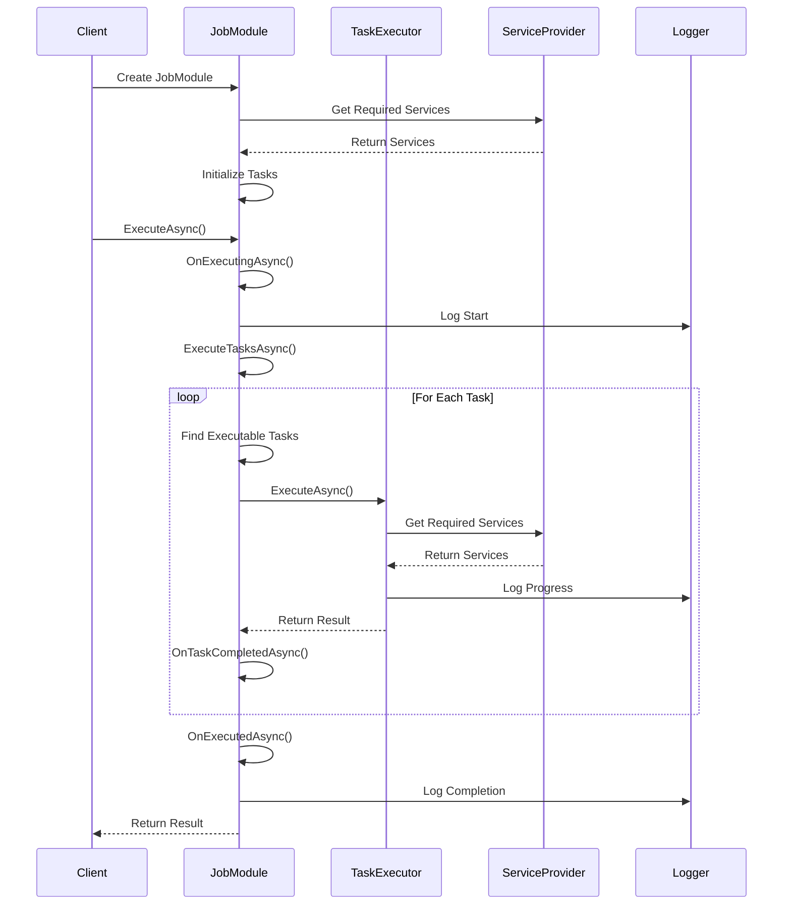
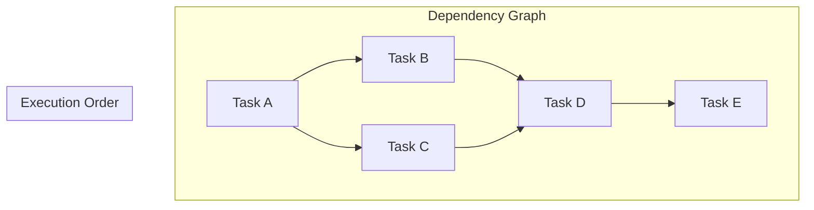
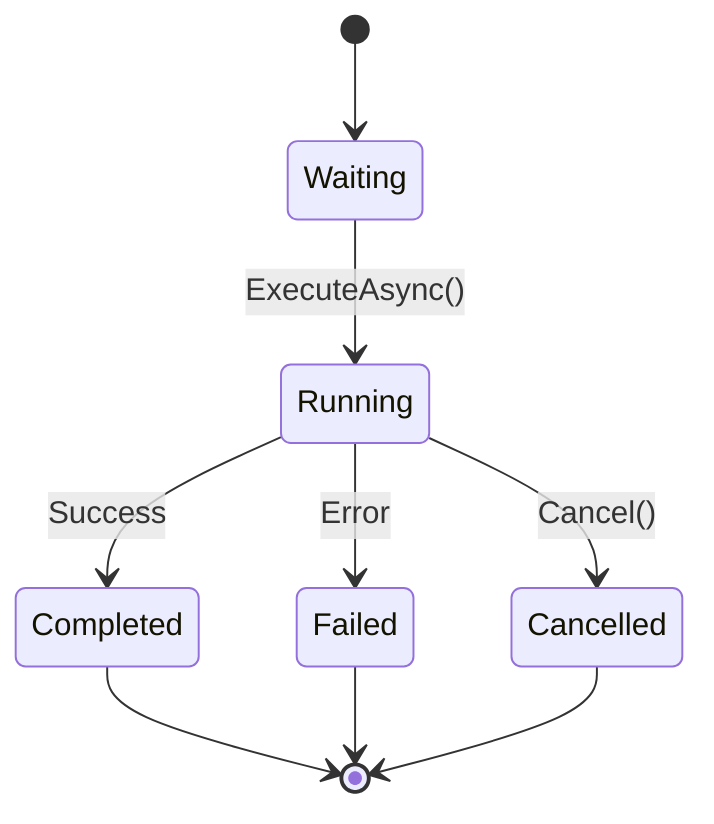
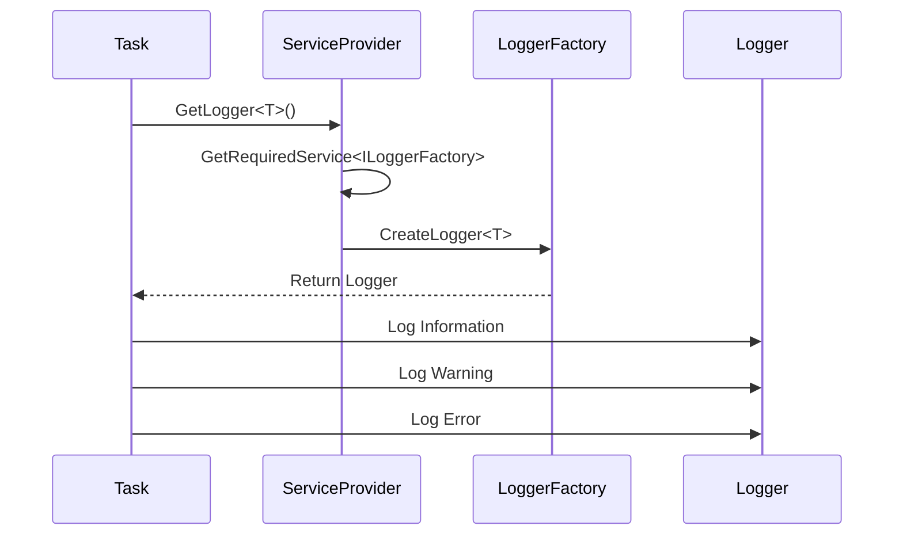
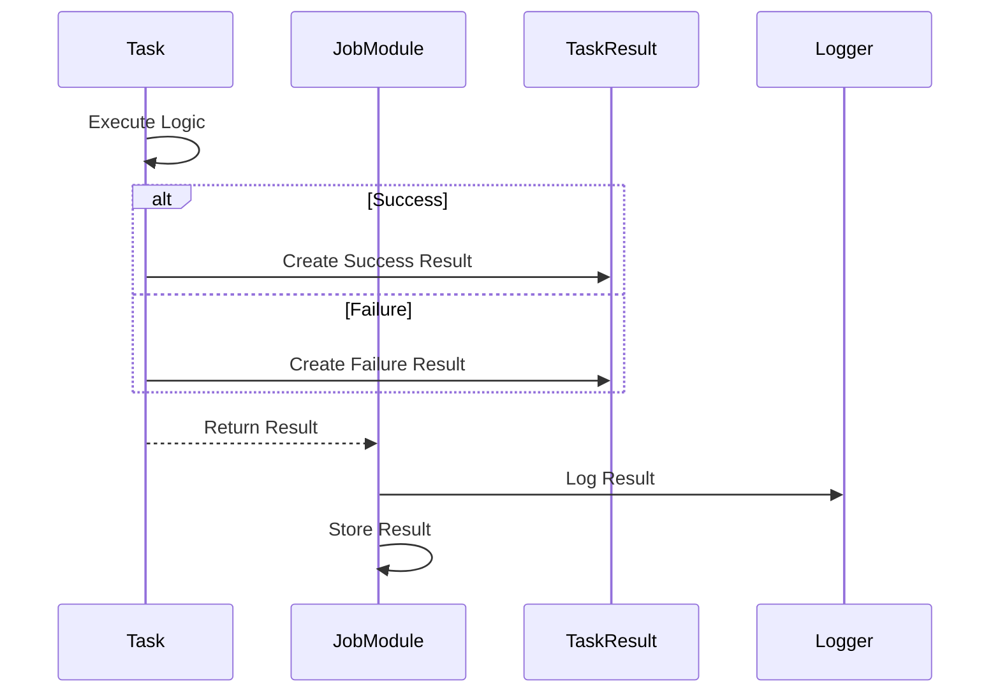
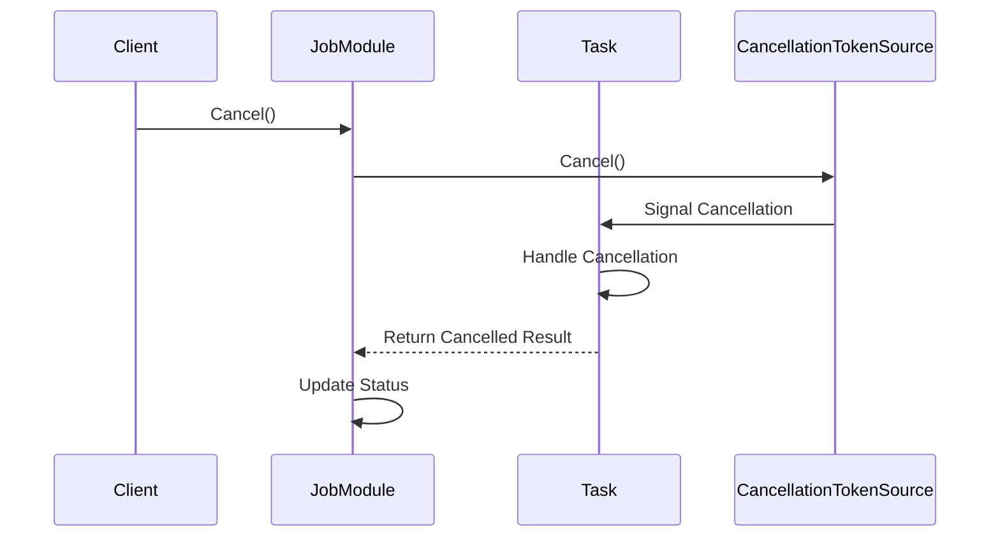
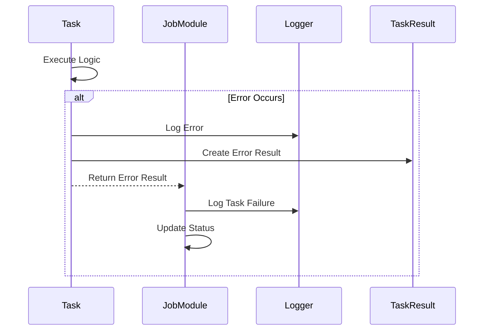
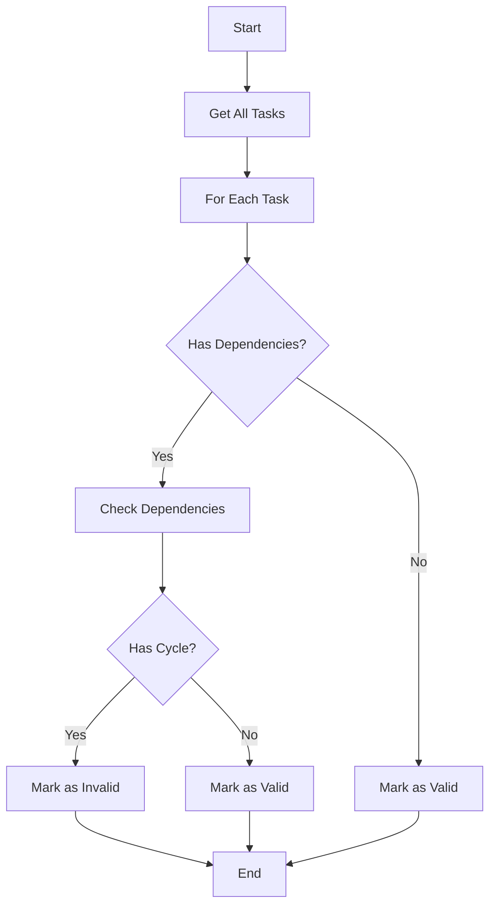
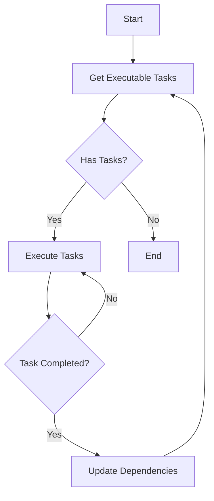

# Cadtastic.JobHost.SDK Process Flows

## Overview

This document describes the key process flows and call sequences in the Cadtastic.JobHost.SDK.

## Job Execution Flow

## Task Dependency Management

## Task Execution States

## Service Provider and Logging

## Task Result Flow

## Cancellation Flow

## Error Handling Flow

## Task Dependency Validation

## Task Execution Strategy

## Notes

1. All flows include proper error handling and logging
2. Task execution is managed with thread safety in mind
3. Dependencies are validated before execution
4. Cancellation is supported at all levels
5. Results are tracked and stored for each task
6. Logging is comprehensive and categorized
7. Service provider is used for dependency injection
8. All operations are asynchronous where appropriate 