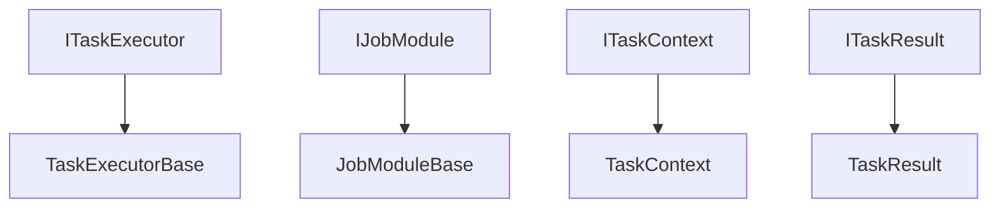

# Cadtastic.JobHost.SDK

**Last Updated:** 06/17/2025 05:10 PM

The Cadtastic.JobHost.SDK provides the core interfaces, base classes, and utilities needed to create job modules and task executors for the Cadtastic.JobHost framework. This SDK enables developers to create modular, maintainable, and type-safe job implementations.

## SDK Components

### Core Interfaces



### Directory Structure

- `Base/`: Base classes for common implementations
- `Interfaces/`: Core interfaces for the SDK
- `Helpers/`: Utility classes and helper methods
- `Models/`: Data models and DTOs
- `Exceptions/`: Custom exception types
- `Extensions/`: Extension methods

## Getting Started

### Installation

```bash
dotnet add package Cadtastic.JobHost.SDK
```

### Basic Usage

1. Create a job module:

```csharp
public class MyJobModule : IJobModule
{
    public string JobType => "MyJob";

    public IEnumerable<Type> ExecutorTypes => new[]
    {
        typeof(DataPreparationTask),
        typeof(DataProcessingTask)
    };
}
```

2. Create task executors:

```csharp
public class DataPreparationTask : TaskExecutorBase
{
    public override string TaskId => "DataPreparation";
    
    public override IReadOnlyCollection<Type> Dependencies => 
        TaskDependency.None();

    public override async Task<ITaskResult> ExecuteAsync(ITaskContext context)
    {
        try
        {
            // Implementation
            return TaskResult.Success();
        }
        catch (Exception ex)
        {
            return TaskResult.Failure(ex.Message);
        }
    }
}
```

## Core Components

### Task Executors

Task executors are the building blocks of jobs. They implement specific functionality and can declare dependencies on other tasks.

#### Base Class

```csharp
public abstract class TaskExecutorBase : ITaskExecutor
{
    public abstract string TaskId { get; }
    public abstract IReadOnlyCollection<Type> Dependencies { get; }
    public virtual bool IsCritical => false;
    public virtual bool CanRunConcurrently => false;
    public abstract Task<ITaskResult> ExecuteAsync(ITaskContext context);
}
```

#### Dependency Management

Use the `TaskDependency` helper class to declare dependencies:

```csharp
// Single dependency
TaskDependency.On<DataPreparationTask>()

// Multiple dependencies
TaskDependency.On<DataPreparationTask, DataProcessingTask>()

// No dependencies
TaskDependency.None()
```

### Task Results

Task results provide information about task execution:

```csharp
// Success result
TaskResult.Success()

// Failure result
TaskResult.Failure("Error message")

// Custom result
TaskResult.Create(success: true, message: "Custom message")
```

### Task Context

The task context provides access to job information and task results:

```csharp
public interface ITaskContext
{
    IJob Job { get; }
    IReadOnlyDictionary<string, ITaskResult> Results { get; }
    void AddResult(string taskId, ITaskResult result);
}
```

## Best Practices

### Task Design

1. Single Responsibility
   - 1.1 Each task should do one thing well
   - 1.2 Keep tasks focused and maintainable
   - 1.3 Use clear, descriptive names

2. Dependency Management
   - 2.1 Minimize dependencies
   - 2.2 Avoid circular dependencies
   - 2.3 Use type-safe dependency declarations

3. Error Handling
   - 3.1 Implement proper error handling
   - 3.2 Use meaningful error messages
   - 3.3 Consider task criticality

4. Performance
   - 4.1 Use async/await properly
   - 4.2 Consider task concurrency
   - 4.3 Optimize resource usage

### Module Organization

1. Task Grouping
   - 1.1 Group related tasks
   - 1.2 Use consistent naming
   - 1.3 Maintain clear boundaries

2. Exposure Control
   - 2.1 Expose only necessary tasks
   - 2.2 Use internal tasks when appropriate
   - 2.3 Document public tasks

## Development Guidelines

### Code Style

1. Naming Conventions
   - 1.1 Use PascalCase for public members
   - 1.2 Use camelCase for private members
   - 1.3 Use descriptive names

2. Documentation
   - 2.1 Document all public members
   - 2.2 Use XML comments
   - 2.3 Include examples

3. Error Handling
   - 3.1 Use custom exceptions
   - 3.2 Provide meaningful messages
   - 3.3 Handle all error cases

### Testing

1. Unit Testing
   - 1.1 Test individual tasks
   - 1.2 Mock dependencies
   - 1.3 Test error cases

2. Integration Testing
   - 2.1 Test task interactions
   - 2.2 Test module loading
   - 2.3 Test error handling

## API Reference

### Interfaces

#### ITaskExecutor

```csharp
public interface ITaskExecutor
{
    string TaskId { get; }
    IReadOnlyCollection<Type> Dependencies { get; }
    bool IsCritical { get; }
    bool CanRunConcurrently { get; }
    Task<ITaskResult> ExecuteAsync(ITaskContext context);
}
```

#### IJobModule

```csharp
public interface IJobModule
{
    string JobType { get; }
    IEnumerable<Type> ExecutorTypes { get; }
}
```

#### ITaskContext

```csharp
public interface ITaskContext
{
    IJob Job { get; }
    IReadOnlyDictionary<string, ITaskResult> Results { get; }
    void AddResult(string taskId, ITaskResult result);
}
```

### Models

#### TaskResult

```csharp
public class TaskResult : ITaskResult
{
    public bool IsSuccess { get; }
    public string? ErrorMessage { get; }
    public DateTime Timestamp { get; }
}
```

#### Job

```csharp
public class Job : IJob
{
    public string Id { get; }
    public string JobType { get; }
    public JobStatus Status { get; }
    public DateTime CreatedAt { get; }
}
```

## Contributing

1. Follow SOLID principles
2. Maintain XML documentation
3. Write unit tests
4. Follow code style guidelines
5. Update documentation

## License

[License information here]  
